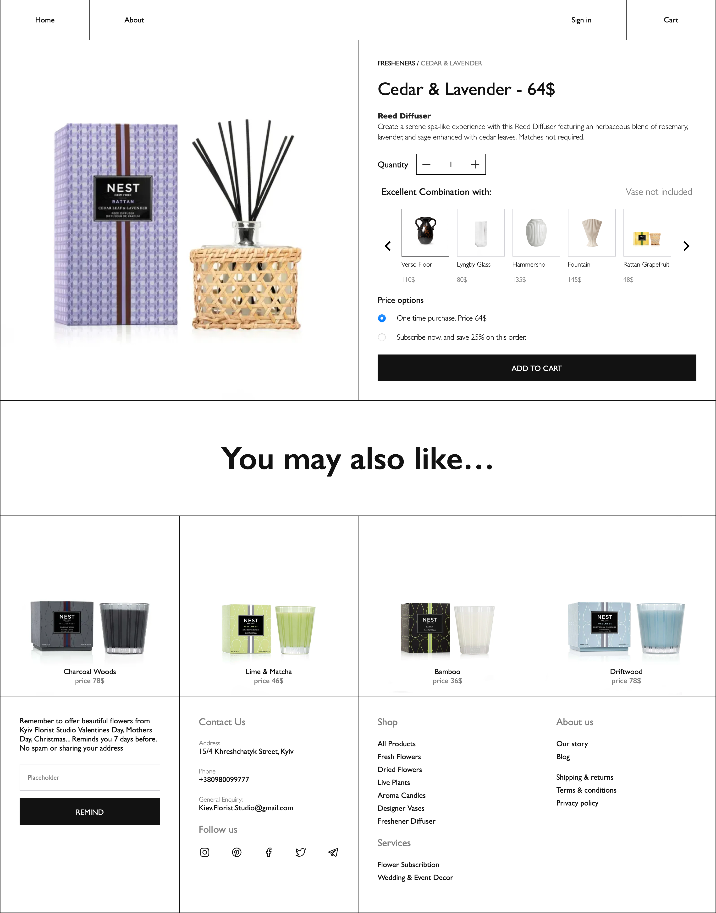

<h1>Kiyv Luxe Bouquets</h1>
<p>A project based on an open-source disign from Figma</p>
<div style="display: flex; gap: 50px">
  <a href="https://skillicons.dev">
    
  </a>
  <a href="https://skillicons.dev">
    
  </a>
  <a href="https://skillicons.dev">
    
  </a>
  <a href="https://skillicons.dev">
    
  </a>
  <a href="https://skillicons.dev">
    
  </a>
</div>

<h2>Preview</h2>
<div style="display: flex; flex-direction: column; gap: 50px">
    
    
    
    
</div>

<h2>To run and view (terminal)</h2>

```
git clone https://github.com/Pascal-Adrian/luxe_bouquets.git
```

```
cd luxe_bouquets
```

```
npm run dev
```

### Now access http://localhost:5173
